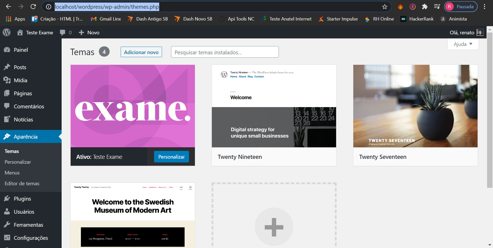
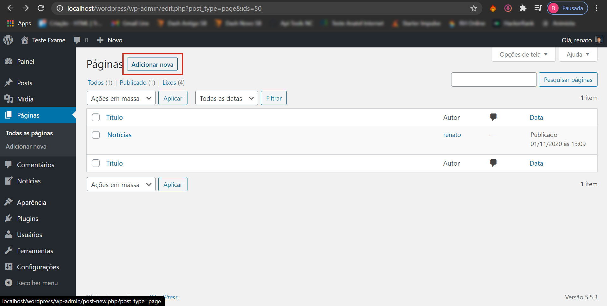
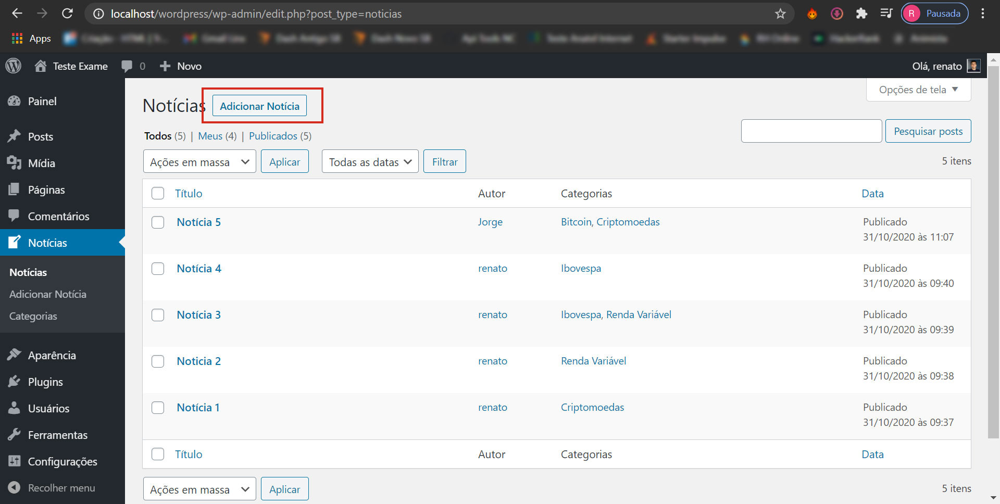
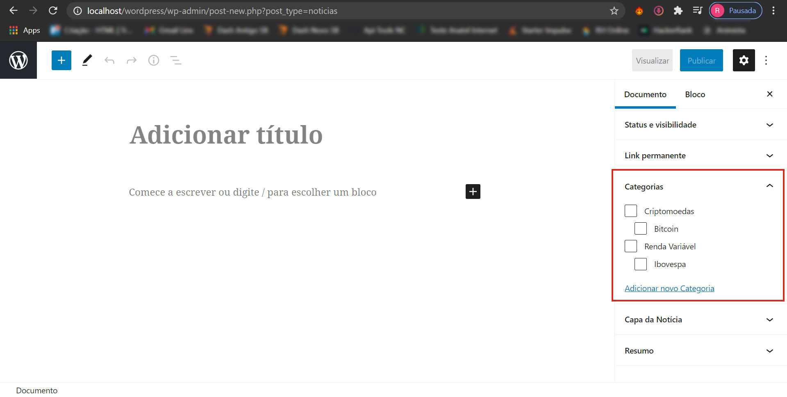
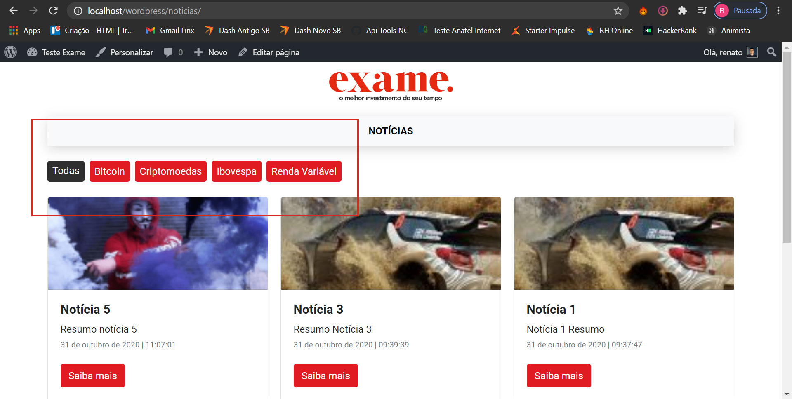

# Exame WP Challenge

Instruções Iniciais:

- Instale um ambiente PHP. Eu usei o [XAMPP](https://www.apachefriends.org/pt_br/index.html). Instale o wordpress na máquina local.
- Navegue para: ...\wp-content\themes\ e jogue dentro, a branch master desse repositório.
- [Localize o tema no dashboard do WP](#localize-o-tema), navegando para Aparência > Temas (.../wp-admin/themes.php).
- [Crie uma página chamada Notícias](#crie-uma-pagina-chamada-noticias), navegando para Páginas > Todas as páginas > Adicionar Nova (.../wp-admin/edit.php?post_type=page). OBS: Não precisa escrever nada nela, se não quiser, mas é necessário, criá-la e salvá-la. 
- [Crie e Categorize as Notícias](#crie-e-categorize-noticias), navegando para Notícias > Notícias > Adicionar Nova (.../wp-admin/edit.php?post_type=noticias).
- É importante [certificar que os permalinks estão selecionados como nome do post](#importante) em Configurações > Links Permanentes (.../wp-admin/options-permalink.php), senão as páginas das notícias não abrirão, e você será redirecionado para a home do site.
- Para consultar o json com todas as notícias, acrescente a url da home: **/wp-json/wp/v2/noticias/**. Exemplo: http://localhost/wordpress/wp-json/wp/v2/noticias/.

## Localize o tema

    

## Crie uma página chamada Notícias

    

## Crie e Categorize Notícias

**Crie Notícias**

    

**Categorize as notícias**

    

**Após cadastrar as notícias e suas taxonomias, você pode navegar pelas páginas como abaixo:**

    

## Importante

    

