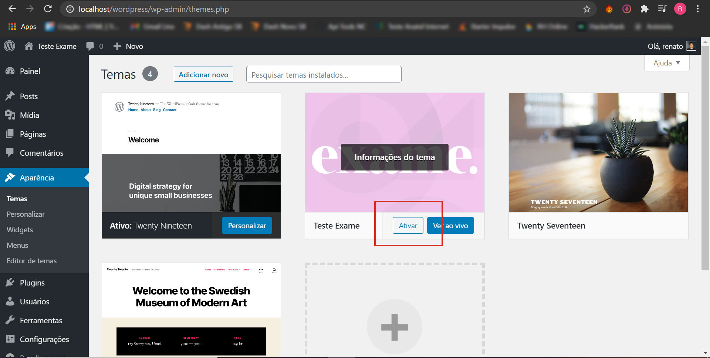
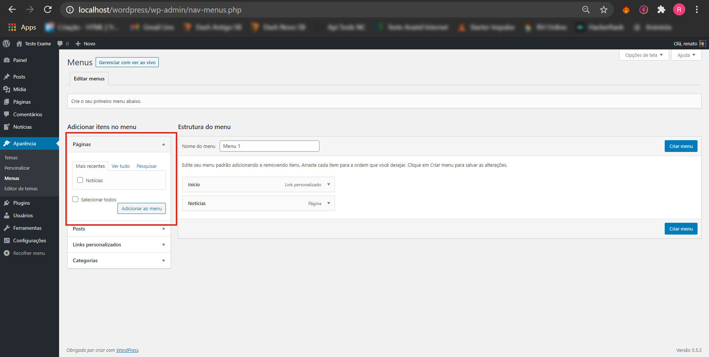

# Exame WP Challenge

**Instruções Iniciais:**

- Instale um ambiente PHP. Eu usei o [XAMPP](https://www.apachefriends.org/pt_br/index.html). Instale o wordpress na máquina local.
- Navegue para: ...\wp-content\themes\ e jogue dentro, a branch master desse repositório.
- [Localize e ative o tema no dashboard do WP](#localize-e-ative-o-tema), navegando para Aparência > Temas (.../wp-admin/themes.php).
- [Crie uma página chamada Notícias](#crie-uma-pagina-chamada-noticias), navegando para Páginas > Todas as páginas > Adicionar Nova (.../wp-admin/edit.php?post_type=page). OBS: Não precisa escrever nada nela, se não quiser, mas é necessário, criá-la e salvá-la.
- Normalmente as páginas criadas, já são adicionadas ao menu do site. Mas caso não consiga visualizá-la no menu do header, [siga esses passos](#noticias-no-menu), navegando para Aparência > Menus (.../wp-admin/nav-menus.php) e adicione a página ao menu.
- [Crie e Categorize as Notícias](#crie-e-categorize-noticias), navegando para Notícias > Notícias > Adicionar Nova (.../wp-admin/edit.php?post_type=noticias).
- É importante [certificar que os permalinks estão selecionados como nome do post](#importante) em Configurações > Links Permanentes (.../wp-admin/options-permalink.php), senão as páginas das notícias não abrirão, e você será redirecionado para a home do site.
- Se desejar, [crie um novo usuário e senha, com a função de editor](#crie-um-novo-user-editor). Faça o login novamente, para ver como o dash dele é mais limpo e adaptado as necessidades que ele terá.

**API Rest WP**

- Para consultar o json com todas as notícias, acrescente a url da home: **/wp-json/wp/v2/noticias/**. Exemplo: http://localhost/wordpress/wp-json/wp/v2/noticias/.

## Localize e Ative o tema

    

## Crie uma página chamada Notícias

    

## Crie e Categorize Notícias

**Crie Notícias**

    

**Categorize as notícias**

    

## Notícias no menu

    

**Após cadastrar as notícias e suas taxonomias, você pode navegar na página notícia como abaixo:**

    

**Ver a home como abaixo, com as 3 últimas notícias cadastradas:**

    

**Ou clicar na notícia e ver a single.php dela assim:**

    

**Ou clicar na taxonomia da notícia a ver todas outras que possuem a mesma:**

    

## Importante

    

## Crie um novo user editor

**Crie um novo usuário e senha, com a função de editor**

    

**Veja o dash para usuários com função de editor**

    

